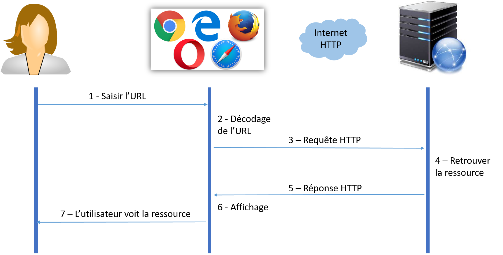

# Fonctionnement d'un site web de bout en bout

L'objectif est ici de montrer qu'un site web est constitué de plusieurs ressources (pages HTML, feuilles de style CSS, scripts JavaScript, images, vidéo, son).
Ces ressources sont gérées par le serveur web qui les rend accessibles via le protocole HTTP.
Un utilisateur utilise son navigateur et interagit avec celui-ci. Le navigateur présente (affiche) les ressources à l'utilisateur. Selon les interactions réalisées par l'utilisateur, le navigateur interagit avec le serveur pour accéder à de nouvelles ressources et les afficher.

## Au commencement il y a l'URL

(cette section n'apparatient pas au programme mais il me semble intéressant de la présenter ici)

Après avoir démarré son navigateur, la première chose qu'un utilisateur fait pour accéder à un site web et de **saisir l'URL du site**.

L'URL d'un site c'est ce que l'on écrit dans la barre de navigation du navigateur (figure suivante)

Voici quelques exemples d'URL que vous pouvez utiliser:
* http://www.google.com
* http://www.youtube.com
* https://www.education.gouv.fr/cid138218/au-bo-special-du-22-janvier-2019-programmes-d-enseignement-du-lycee-general-et-technologique.html

Une URL est composée au moins de 2 parties :
* Le **protocole** (http://) ou (https://)
* Le **nom du serveur web** (www.education.gouv.fr)

Certaines URL contiennent une troisième partie :
* Le **nom de la ressource**  (cid138218/au-bo-special-du-22-janvier-2019-programmes-d-enseignement-du-lycee-general-et-technologique.html)

Il y a même une quatrième partie qui est parfois utilisée dans une URL mais cela est beaucoup plus rare (essentiellement en mode programmation en local)
* le **numéro du port**, ici 3000 (http://localhost:3000/index.html) 

Sur le web, seuls les protocoles HTTP et HTTPS sont utilisés. Ces protocoles sont standards. Ils précisent comment sont réalisés les échanges entre un navigateur et un serveur web. HTTPS est la version sécurisée de HTTP.

Un serveur web est tout le temps connecté à internet. Il a donc une adresse IP qui est tout le temps joignable.
Pour le retrouver facilement son adresse IP est lié à un nom. C'est le système DNS (Domain Naming Service) qui fait le lien entre une adress IP et son nom. Par exemple l'adresse IP de google est 216.58.209.228. Si vous écrivez cette URL http://216.58.209.228 vous irez sur http://www.google.com.

Les navigateurs web sont relativement souples car, si vous ne saisissez pas le protocole, ils le font pour vous. 
Par exemple, si vous saisissez (www.google.com) dans la barre de navigation, votre navigateur comprendra que le protocole est HTTP (voir même HTTPS).

Les serveurs web quant à eux disposent tous d'une **ressource par défaut**. 
Si vous saisissez uniquement le protocole et le nom du serveur, c'est cette ressource par défaut que vous demandez (souvent c'est la page principale du site web - index.html).

Les navigateurs récents sont même directement liés à un moteur de recherche (Google, Bing, etc.). Si vous tappez autre chose qu'une URL dans la barre de navigation, ils considèrent que vous avez tapé une question et ils vous présentent la réponse émise par le moteur de recherche.

### A retenir

Une URL identifie :
* un protocole
* un serveur web
* un port du serveur web (rare)
* une ressource du serveur web (sinon c'est la ressource par défaut qui sera accédée)

Lorsqu'on saisie une URL dans la barre de navigation du navigateur, on demande au navigateur d'afficher la ressource ciblée.

## Chargement de la première ressource

Saisir une URL dans la barre de navigation est une interaction entre l'utilisateur et le navigateur web.

Une fois cette saisie réalisée, le navigateur va alors décoder l'URL afin d'envoyer une requête HTTP vers le serveur. 

Le serveur web va alors recevoir cette requête et y répondre en envoyant la ressource correspondante.

Le navigateur va alors afficher la ressource afin que l'utilisateur puisse la voir.

La figure suivante présente cette suite d'intéractions :

La figure illustre le rôle joué par le navigateur. Il gère les intéractions avec l'utilisateur et les traduit en échanges avec le serveur. De plus, son rôle est d'afficher les ressources.

Le serveur web quant à lui gère les ressources et les communique au navigateur. 